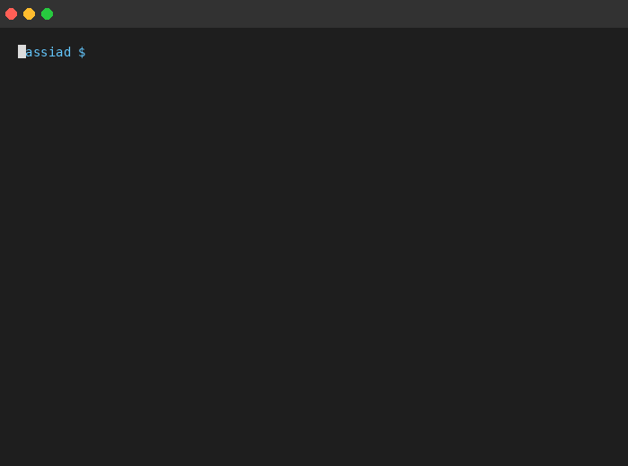

<p align="center">
  
</p>

<h1 align="center">Assiad Aldebiyat</h1>
<p align="center">
  <strong>Engineering Lead</strong> · 7+ Years · Canada 🇨🇦<br/>
  <em>I build systems that scale to millions of users and don't break at 3am.</em>
</p>

<p align="center">
  <a href="https://aaldebiyat.vercel.app">Portfolio</a> •
  <a href="https://www.linkedin.com/in/assiad-aldebiyat-4361ba125">LinkedIn</a> •
  <a href="mailto:aaldebiyat@gmail.com">Email</a>
</p>

---

### The short version

I'm a backend-heavy full-stack engineer who obsesses over performance, data architecture, and building things that actually work at scale. I've shipped platforms used across **170+ countries**, optimized queries by **40%**, and led teams through complex migrations without breaking production.

Bilingual (EN/FR) · Based in Hamilton, Ontario

---

### 🛠 Skills

<table>
  <tr>
    <td valign="top" width="33%">
      <h4>Frontend</h4>
      <p>
        <a href="https://react.dev"></a>
        <a href="https://nextjs.org"></a>
        <a href="https://angular.io"></a>
        <a href="https://redux.js.org"></a>
        <br/>
        <a href="https://www.typescriptlang.org"></a>
        <a href="https://developer.mozilla.org/en-US/docs/Web/JavaScript"></a>
        <a href="https://developer.mozilla.org/en-US/docs/Web/HTML"></a>
        <a href="https://developer.mozilla.org/en-US/docs/Web/CSS"></a>
        <br/>
        <a href="https://tailwindcss.com"></a>
        <a href="https://sass-lang.com"></a>
      </p>
    </td>
    <td valign="top" width="33%">
      <h4>Backend</h4>
      <p>
        <a href="https://nodejs.org"></a>
        <a href="https://nestjs.com"></a>
        <a href="https://expressjs.com"></a>
        <a href="https://go.dev"></a>
        <br/>
        <a href="https://graphql.org"></a>
        <a href="https://www.apollographql.com"></a>
        <br/>
        <a href="https://www.postgresql.org"></a>
        <a href="https://www.mongodb.com"></a>
        <a href="https://redis.io"></a>
      </p>
    </td>
    <td valign="top" width="33%">
      <h4>DevOps & Tools</h4>
      <p>
        <a href="https://www.docker.com"></a>
        <a href="https://kubernetes.io"></a>
        <a href="https://aws.amazon.com"></a>
        <br/>
        <a href="https://github.com"></a>
        <a href="https://github.com/features/actions"></a>
        <a href="https://www.jenkins.io"></a>
        <br/>
        <a href="https://www.elastic.co/elasticsearch"></a>
        <a href="https://www.rabbitmq.com"></a>
      </p>
    </td>
  </tr>
</table>

---

### What I actually do

| Area | What that means in practice |
|------|----------------------------|
| **Backend Architecture** | Design APIs and services that handle real traffic without falling over. Golang, Node.js, NestJS, GraphQL, gRPC. |
| **Data & Performance** | Query optimization, indexing strategies, caching layers. I've cut response times by 40% on production systems. |
| **Search & Analytics** | Built embedded analytics platforms from scratch. Elasticsearch, Typesense, data pipelines. |
| **Cloud Infrastructure** | Docker, Kubernetes, AWS. I deploy things that stay deployed. |
| **Team Leadership** | Code reviews, mentorship, architectural decisions. I make teams faster, not just codebases. |

---

### Where I've built things

**ToursByLocals** · Engineering Lead · 2025–Present  
Global travel platform, 170+ countries. Full-stack features, 40% query performance improvement, payment integrations (PayPal, Adyen), mentoring engineers.

**Rose Rocket** · Full Stack Engineer · 2023–2024  
Built their embedded analytics platform from the ground up. Led migration from Looker to Luzmo. Golang, Node, PostgreSQL, Elasticsearch.

**Euronews** · Full Stack Engineer · 2021–2023  
Multilingual CMS supporting 12+ languages. AWS migration with zero downtime. 200+ automated tests. Legacy modernization.

**Ship&Co** · Full Stack Engineer · 2020–2021  
Mobility hub API integrating transport operators across France and Australia. 60% system performance improvement.

---

### Things I've shipped

- **Analytics Platform** — Embedded BI tool built with Golang, Node, and Elasticsearch. Real-time dashboards for logistics customers.
- **Search Infrastructure** — Typesense integration that cut search latency and improved relevance scoring.
- **Payment Systems** — Multi-provider payment integration (PayPal, Adyen) handling international transactions.
- **Multilingual CMS** — Content system supporting 12+ languages with optimized database structures.

---

### How I think about engineering

```
1. Make it work
2. Make it right
3. Make it fast
4. Make it maintainable by someone who isn't you
```

I care about code that survives contact with real users, real traffic, and real deadlines. I'd rather ship something solid than something clever.

---

<p align="center">
  <em>Open to interesting problems and teams that ship.</em><br/><br/>
  <a href="mailto:aaldebiyat@gmail.com">aaldebiyat@gmail.com</a>
</p>
